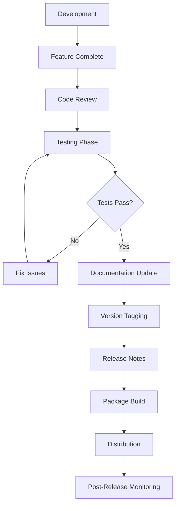

# 🔧 Maintenance & Support

**Datei:** 10-Maintenance.md  
**Version:** 2.0.0  

## 📋 Inhalt

1. [Maintenance Philosophy](#maintenance-philosophy)
2. [Version Management](#version-management)
3. [Monitoring & Diagnostics](#monitoring--diagnostics)
4. [Update Procedures](#update-procedures)
5. [Support & Troubleshooting](#support--troubleshooting)
6. [Documentation Maintenance](#documentation-maintenance)

---

## 🎯 Maintenance Philosophy

### Maintenance Strategy

```
HHN PDF Generator Maintenance Framework:
├── Proactive Maintenance (80%)
│   ├── Preventive monitoring
│   ├── Automated testing
│   ├── Performance optimization
│   └── Security updates
│
├── Reactive Maintenance (15%)
│   ├── Bug fixes
│   ├── User-reported issues
│   ├── Compatibility problems
│   └── Emergency patches
│
└── Adaptive Maintenance (5%)
    ├── Feature enhancements
    ├── Technology upgrades
    ├── Platform adaptations
    └── User experience improvements
```

### Maintenance Principles

```yaml
Reliability: "System should work consistently across environments"
Performance: "Generation times should remain within acceptable limits"
Security: "Dependencies should be regularly updated for vulnerabilities"
Compatibility: "Support for multiple Python versions and platforms"
Usability: "Clear error messages and helpful diagnostics"
Maintainability: "Code should be easy to understand and modify"
```

### Service Level Objectives (SLOs)

```yaml
Availability: "> 99.5% uptime for critical functionality"
Performance: 
  - "Small documents (< 10 pages): < 3 seconds"
  - "Large documents (< 100 pages): < 30 seconds"
  - "Memory usage: < 200 MB peak"
Reliability: "< 0.1% failure rate for valid inputs"
Recovery: "< 1 hour mean time to recovery (MTTR)"
```

---

## 📦 Version Management

### Semantic Versioning Strategy

#### Version Number Format: MAJOR.MINOR.PATCH

```yaml
MAJOR (X.0.0): "Incompatible API changes"
  Examples:
    - "Changes to YAML schema that break existing documents"
    - "Removal of deprecated features"
    - "Major architecture changes"
    - "Minimum Python version increases"

MINOR (0.X.0): "Backward-compatible functionality additions"
  Examples:
    - "New YAML configuration options"
    - "Additional markdown formatting support"
    - "New CLI parameters"
    - "Performance improvements"

PATCH (0.0.X): "Backward-compatible bug fixes"
  Examples:
    - "Bug fixes in PDF generation"
    - "Dependency updates"
    - "Documentation corrections"
    - "Error message improvements"
```

### Release Planning

#### Release Schedule

```yaml
Major Releases: "Annually (January)"
  - "Comprehensive feature additions"
  - "Architecture improvements"
  - "Breaking changes with migration guide"

Minor Releases: "Quarterly (April, July, October)"
  - "New features and enhancements"
  - "Performance optimizations"
  - "Dependency updates"

Patch Releases: "As needed (within 1 week of critical issues)"
  - "Critical bug fixes"
  - "Security patches"
  - "Compatibility fixes"
```

#### Release Process



### Changelog Management

#### CHANGELOG.md Format

```markdown
# Changelog

All notable changes to HHN PDF Generator will be documented in this file.

The format is based on [Keep a Changelog](https://keepachangelog.com/en/1.0.0/),
and this project adheres to [Semantic Versioning](https://semver.org/spec/v2.0.0.html).

## [Unreleased]

### Added
- New features that have been added

### Changed
- Changes in existing functionality

### Deprecated
- Soon-to-be removed features

### Removed
- Features removed in this release

### Fixed
- Bug fixes

### Security
- Security vulnerability fixes

## [2.0.0] - 2024-12-31

### Added
- Two-pass PDF generation system for accurate page numbering
- Intelligent logo caching with HTTP download support
- Comprehensive error handling and validation
- Performance monitoring and optimization
- Docker deployment support
- Extensive test suite with coverage reporting

### Changed
- Complete rewrite of PDF generation engine
- Improved YAML schema validation
- Enhanced markdown processing capabilities
- Modernized codebase with type hints

### Removed
- Legacy single-pass generation method
- Deprecated configuration options

### Fixed
- TOC page number accuracy issues
- Memory leaks in large document processing
- Unicode handling in document titles
- Logo aspect ratio preservation

### Security
- Updated all dependencies to latest secure versions
- Added input validation for YAML front-matter
- Implemented secure file handling

## [1.x.x] - Previous Versions
[Previous version history...]
```

---

## 📊 Monitoring & Diagnostics

### Health Monitoring System

#### System Health Metrics

```python
# monitoring/health_monitor.py
import psutil
import time
import logging
from dataclasses import dataclass
from typing import Dict, Any, Optional
from datetime import datetime, timedelta

@dataclass
class HealthMetrics:
    """System health metrics structure"""
    timestamp: datetime
    cpu_usage: float
    memory_usage: float
    disk_usage: float
    active_processes: int
    generation_queue_size: int
    error_rate: float
    response_time_avg: float

class HealthMonitor:
    """
    Comprehensive health monitoring system
    
    Features:
    ├── System resource monitoring
    ├── Performance metrics collection
    ├── Error rate tracking
    ├── Alert generation
    └── Historical data retention
    """
    
    def __init__(self, alert_threshold: Dict[str, float] = None):
        self.alert_threshold = alert_threshold or {
            'cpu_usage': 80.0,      # 80% CPU usage
            'memory_usage': 85.0,   # 85% memory usage
            'disk_usage': 90.0,     # 90% disk usage
            'error_rate': 5.0,      # 5% error rate
            'response_time': 30.0   # 30 seconds response time
        }
        
        self.metrics_history = []
        self.error_count = 0
        self.success_count = 0
        self.response_times = []
        
        self.logger = logging.getLogger(__name__)
    
    def collect_metrics(self) -> HealthMetrics:
        """Collect current system health metrics"""
        
        # System metrics
        cpu_usage = psutil.cpu_percent(interval=1)
        memory = psutil.virtual_memory()
        disk = psutil.disk_usage('/')
        
        # Application metrics
        error_rate = self._calculate_error_rate()
        avg_response_time = self._calculate_avg_response_time()
        
        metrics = HealthMetrics(
            timestamp=datetime.now(),
            cpu_usage=cpu_usage,
            memory_usage=memory.percent,
            disk_usage=(disk.used / disk.total) * 100,
            active_processes=len(psutil.pids()),
            generation_queue_size=0,  # Would be actual queue size
            error_rate=error_rate,
            response_time_avg=avg_response_time
        )
        
        # Store metrics
        self.metrics_history.append(metrics)
        
        # Cleanup old metrics (keep last 24 hours)
        cutoff_time = datetime.now() - timedelta(hours=24)
        self.metrics_history = [
            m for m in self.metrics_history 
            if m.timestamp > cutoff_time
        ]
        
        # Check alerts
        self._check_alerts(metrics)
        
        return metrics
    
    def _calculate_error_rate(self) -> float:
        """Calculate current error rate percentage"""
        total_requests = self.success_count + self.error_count
        if total_requests == 0:
            return 0.0
        return (self.error_count / total_requests) * 100
    
    def _calculate_avg_response_time(self) -> float:
        """Calculate average response time"""
        if not self.response_times:
            return 0.0
        return sum(self.response_times) / len(self.response_times)
    
    def _check_alerts(self, metrics: HealthMetrics):
        """Check metrics against alert thresholds"""
        
        alerts = []
        
        if metrics.cpu_usage > self.alert_threshold['cpu_usage']:
            alerts.append(f"High CPU usage: {metrics.cpu_usage:.1f}%")
        
        if metrics.memory_usage > self.alert_threshold['memory_usage']:
            alerts.append(f"High memory usage: {metrics.memory_usage:.1f}%")
        
        if metrics.disk_usage > self.alert_threshold['disk_usage']:
            alerts.append(f"High disk usage: {metrics.disk_usage:.1f}%")
        
        if metrics.error_rate > self.alert_threshold['error_rate']:
            alerts.append(f"High error rate: {metrics.error_rate:.1f}%")
        
        if metrics.response_time_avg > self.alert_threshold['response_time']:
            alerts.append(f"Slow response time: {metrics.response_time_avg:.1f}s")
        
        # Log alerts
        for alert in alerts:
            self.logger.warning(f"ALERT: {alert}")
        
        return alerts
    
    def record_success(self, response_time: float):
        """Record a successful operation"""
        self.success_count += 1
        self.response_times.append(response_time)
        
        # Keep only recent response times
        if len(self.response_times) > 1000:
            self.response_times = self.response_times[-500:]
    
    def record_error(self):
        """Record a failed operation"""
        self.error_count += 1
    
    def get_health_report(self) -> Dict[str, Any]:
        """Generate comprehensive health report"""
        
        latest_metrics = self.metrics_history[-1] if self.metrics_history else None
        
        if not latest_metrics:
            return {"status": "unknown", "message": "No metrics available"}
        
        # Determine overall health status
        status = "healthy"
        alerts = self._check_alerts(latest_metrics)
        
        if alerts:
            status = "warning" if len(alerts) <= 2 else "critical"
        
        # Calculate trends (last hour vs. previous hour)
        trends = self._calculate_trends()
        
        return {
            "status": status,
            "timestamp": latest_metrics.timestamp.isoformat(),
            "metrics": {
                "cpu_usage": f"{latest_metrics.cpu_usage:.1f}%",
                "memory_usage": f"{latest_metrics.memory_usage:.1f}%",
                "disk_usage": f"{latest_metrics.disk_usage:.1f}%",
                "error_rate": f"{latest_metrics.error_rate:.2f}%",
                "avg_response_time": f"{latest_metrics.response_time_avg:.2f}s"
            },
            "alerts": alerts,
            "trends": trends,
            "total_operations": self.success_count + self.error_count,
            "success_rate": f"{(self.success_count / max(1, self.success_count + self.error_count)) * 100:.2f}%"
        }
    
    def _calculate_trends(self) -> Dict[str, str]:
        """Calculate metric trends over time"""
        
        if len(self.metrics_history) < 2:
            return {}
        
        # Compare latest hour with previous hour
        now = datetime.now()
        hour_ago = now - timedelta(hours=1)
        two_hours_ago = now - timedelta(hours=2)
        
        recent_metrics = [m for m in self.metrics_history if m.timestamp > hour_ago]
        previous_metrics = [m for m in self.metrics_history if two_hours_ago < m.timestamp <= hour_ago]
        
        if not recent_metrics or not previous_metrics:
            return {}
        
        recent_avg_cpu = sum(m.cpu_usage for m in recent_metrics) / len(recent_metrics)
        previous_avg_cpu = sum(m.cpu_usage for m in previous_metrics) / len(previous_metrics)
        
        recent_avg_memory = sum(m.memory_usage for m in recent_metrics) / len(recent_metrics)
        previous_avg_memory = sum(m.memory_usage for m in previous_metrics) / len(previous_metrics)
        
        def trend_indicator(current: float, previous: float) -> str:
            diff = current - previous
            if abs(diff) < 1.0:
                return "stable"
            return "increasing" if diff > 0 else "decreasing"
        
        return {
            "cpu_trend": trend_indicator(recent_avg_cpu, previous_avg_cpu),
            "memory_trend": trend_indicator(recent_avg_memory, previous_avg_memory)
        }
```

### Logging Strategy

#### Structured Logging Configuration

```python
# monitoring/logging_config.py
import logging
import logging.handlers
import json
from datetime import datetime
from typing import Any, Dict

class StructuredFormatter(logging.Formatter):
    """
    Structured JSON formatter for better log analysis
    
    Output Format:
    {
        "timestamp": "2024-12-31T12:00:00Z",
        "level": "INFO",
        "logger": "hhn_pdf_generator.core",
        "message": "PDF generation completed",
        "data": {
            "input_file": "document.md",
            "output_file": "document.pdf",
            "generation_time": 2.5,
            "page_count": 15
        }
    }
    """
    
    def format(self, record: logging.LogRecord) -> str:
        log_entry = {
            "timestamp": datetime.utcnow().isoformat() + "Z",
            "level": record.levelname,
            "logger": record.name,
            "message": record.getMessage(),
        }
        
        # Add extra data if available
        if hasattr(record, 'data'):
            log_entry["data"] = record.data
        
        # Add exception info if present
        if record.exc_info:
            log_entry["exception"] = self.formatException(record.exc_info)
        
        return json.dumps(log_entry, ensure_ascii=False)

def setup_logging(log_level: str = "INFO", log_file: str = None) -> None:
    """
    Configure comprehensive logging system
    
    Features:
    ├── Structured JSON logging
    ├── File rotation
    ├── Console and file outputs
    ├── Performance tracking
    └── Error aggregation
    """
    
    # Root logger configuration
    root_logger = logging.getLogger()
    root_logger.setLevel(getattr(logging, log_level.upper()))
    
    # Remove existing handlers
    for handler in root_logger.handlers[:]:
        root_logger.removeHandler(handler)
    
    # Console handler (human-readable)
    console_handler = logging.StreamHandler()
    console_formatter = logging.Formatter(
        '%(asctime)s - %(name)s - %(levelname)s - %(message)s'
    )
    console_handler.setFormatter(console_formatter)
    console_handler.setLevel(logging.INFO)
    root_logger.addHandler(console_handler)
    
    # File handler (structured JSON)
    if log_file:
        file_handler = logging.handlers.RotatingFileHandler(
            log_file,
            maxBytes=10 * 1024 * 1024,  # 10MB
            backupCount=5
        )
        file_handler.setFormatter(StructuredFormatter())
        file_handler.setLevel(logging.DEBUG)
        root_logger.addHandler(file_handler)
    
    # Error file handler (errors only)
    if log_file:
        error_file = log_file.replace('.log', '_errors.log')
        error_handler = logging.handlers.RotatingFileHandler(
            error_file,
            maxBytes=5 * 1024 * 1024,  # 5MB
            backupCount=3
        )
        error_handler.setFormatter(StructuredFormatter())
        error_handler.setLevel(logging.ERROR)
        root_logger.addHandler(error_handler)

class PerformanceLogger:
    """
    Performance-focused logging utility
    
    Usage:
    with PerformanceLogger("pdf_generation") as perf:
        perf.log_data({"input_size": file_size})
        # ... generation code ...
        perf.log_data({"output_size": output_size})
    """
    
    def __init__(self, operation_name: str):
        self.operation_name = operation_name
        self.start_time = None
        self.data = {}
        self.logger = logging.getLogger(f"performance.{operation_name}")
    
    def __enter__(self):
        self.start_time = time.time()
        self.logger.info(
            f"Started {self.operation_name}",
            extra={"data": {"operation": self.operation_name, "start_time": self.start_time}}
        )
        return self
    
    def __exit__(self, exc_type, exc_val, exc_tb):
        end_time = time.time()
        duration = end_time - self.start_time
        
        log_data = {
            "operation": self.operation_name,
            "duration": duration,
            "success": exc_type is None,
            **self.data
        }
        
        if exc_type:
            log_data["error"] = str(exc_val)
            self.logger.error(
                f"Failed {self.operation_name} after {duration:.2f}s",
                extra={"data": log_data}
            )
        else:
            self.logger.info(
                f"Completed {self.operation_name} in {duration:.2f}s",
                extra={"data": log_data}
            )
    
    def log_data(self, data: Dict[str, Any]):
        """Add data to performance log"""
        self.data.update(data)
```

---

## 🔄 Update Procedures

### Dependency Updates

#### Automated Dependency Monitoring

```python
# maintenance/dependency_monitor.py
import subprocess
import json
import requests
from typing import Dict, List, Tuple
from packaging import version
import logging

class DependencyMonitor:
    """
    Automated dependency monitoring and update system
    
    Features:
    ├── Security vulnerability detection
    ├── Version compatibility checking
    ├── Automated update recommendations
    ├── Breaking change analysis
    └── Update impact assessment
    """
    
    def __init__(self):
        self.logger = logging.getLogger(__name__)
        self.critical_deps = ['reportlab', 'PyYAML', 'Pillow', 'requests']
        
    def check_outdated_packages(self) -> List[Dict]:
        """Check for outdated packages"""
        try:
            result = subprocess.run(
                ['pip', 'list', '--outdated', '--format=json'],
                capture_output=True,
                text=True,
                check=True
            )
            
            outdated_packages = json.loads(result.stdout)
            return outdated_packages
            
        except subprocess.CalledProcessError as e:
            self.logger.error(f"Failed to check outdated packages: {e}")
            return []
    
    def check_security_vulnerabilities(self) -> List[Dict]:
        """Check for security vulnerabilities using safety"""
        try:
            result = subprocess.run(
                ['safety', 'check', '--json'],
                capture_output=True,
                text=True
            )
            
            if result.returncode == 0:
                return []  # No vulnerabilities
            
            vulnerabilities = json.loads(result.stdout)
            return vulnerabilities
            
        except (subprocess.CalledProcessError, json.JSONDecodeError) as e:
            self.logger.error(f"Failed to check security vulnerabilities: {e}")
            return []
    
    def analyze_update_impact(self, package_name: str, current_version: str, new_version: str) -> Dict:
        """Analyze potential impact of package update"""
        
        impact_analysis = {
            "package": package_name,
            "current_version": current_version,
            "new_version": new_version,
            "is_critical": package_name in self.critical_deps,
            "version_type": self._classify_version_change(current_version, new_version),
            "risk_level": "low",
            "breaking_changes": False,
            "recommendations": []
        }
        
        # Classify risk based on version change
        version_type = impact_analysis["version_type"]
        
        if version_type == "major":
            impact_analysis["risk_level"] = "high"
            impact_analysis["breaking_changes"] = True
            impact_analysis["recommendations"].append("Review changelog for breaking changes")
            impact_analysis["recommendations"].append("Test thoroughly before deployment")
        elif version_type == "minor":
            impact_analysis["risk_level"] = "medium"
            impact_analysis["recommendations"].append("Review new features and changes")
            impact_analysis["recommendations"].append("Run full test suite")
        else:  # patch
            impact_analysis["risk_level"] = "low"
            impact_analysis["recommendations"].append("Review bug fixes")
            impact_analysis["recommendations"].append("Run regression tests")
        
        # Additional checks for critical dependencies
        if package_name in self.critical_deps:
            impact_analysis["recommendations"].append("Monitor performance after update")
            
        return impact_analysis
    
    def _classify_version_change(self, current: str, new: str) -> str:
        """Classify version change as major, minor, or patch"""
        try:
            current_ver = version.parse(current)
            new_ver = version.parse(new)
            
            if new_ver.major > current_ver.major:
                return "major"
            elif new_ver.minor > current_ver.minor:
                return "minor"
            else:
                return "patch"
                
        except Exception:
            return "unknown"
    
    def generate_update_plan(self) -> Dict:
        """Generate comprehensive update plan"""
        
        outdated = self.check_outdated_packages()
        vulnerabilities = self.check_security_vulnerabilities()
        
        update_plan = {
            "timestamp": datetime.now().isoformat(),
            "total_outdated": len(outdated),
            "security_issues": len(vulnerabilities),
            "updates": [],
            "security_updates": [],
            "summary": {
                "critical": 0,
                "high_risk": 0,
                "medium_risk": 0,
                "low_risk": 0
            }
        }
        
        # Analyze each outdated package
        for package in outdated:
            analysis = self.analyze_update_impact(
                package["name"],
                package["version"],
                package["latest_version"]
            )
            
            update_plan["updates"].append(analysis)
            
            # Update summary
            if analysis["is_critical"] and analysis["risk_level"] == "high":
                update_plan["summary"]["critical"] += 1
            elif analysis["risk_level"] == "high":
                update_plan["summary"]["high_risk"] += 1
            elif analysis["risk_level"] == "medium":
                update_plan["summary"]["medium_risk"] += 1
            else:
                update_plan["summary"]["low_risk"] += 1
        
        # Add security vulnerabilities
        for vuln in vulnerabilities:
            update_plan["security_updates"].append({
                "package": vuln.get("package_name", "unknown"),
                "vulnerability": vuln.get("vulnerability", "unknown"),
                "severity": vuln.get("severity", "unknown"),
                "recommendation": "Update immediately"
            })
        
        return update_plan
```

### Automated Update Process

```bash
#!/bin/bash
# maintenance/update_dependencies.sh

set -e  # Exit on any error

echo "🔄 Starting HHN PDF Generator Dependency Update Process"

# Backup current environment
echo "📦 Creating backup of current environment..."
pip freeze > requirements_backup_$(date +%Y%m%d_%H%M%S).txt

# Check for security vulnerabilities
echo "🔍 Checking for security vulnerabilities..."
if command -v safety &> /dev/null; then
    safety check || echo "⚠️  Security vulnerabilities detected!"
else
    echo "Installing safety..."
    pip install safety
    safety check || echo "⚠️  Security vulnerabilities detected!"
fi

# Check for outdated packages
echo "📊 Checking for outdated packages..."
outdated_packages=$(pip list --outdated --format=json)
echo "Outdated packages: $outdated_packages"

# Update low-risk packages first
echo "🔄 Updating low-risk packages..."
low_risk_packages=("pytest" "black" "flake8" "mypy")
for package in "${low_risk_packages[@]}"; do
    echo "Updating $package..."
    pip install --upgrade "$package" || echo "Failed to update $package"
done

# Run tests after low-risk updates
echo "🧪 Running tests after low-risk updates..."
python -m pytest tests/unit tests/integration -x --tb=short

# Update medium-risk packages
echo "🔄 Updating medium-risk packages..."
medium_risk_packages=("requests" "Pillow")
for package in "${medium_risk_packages[@]}"; do
    echo "Updating $package..."
    current_version=$(pip show "$package" | grep Version | cut -d' ' -f2)
    pip install --upgrade "$package" || echo "Failed to update $package"
    new_version=$(pip show "$package" | grep Version | cut -d' ' -f2)
    echo "Updated $package from $current_version to $new_version"
done

# Run comprehensive tests
echo "🧪 Running comprehensive tests..."
python -m pytest tests/ --tb=short

# Update high-risk packages (if tests pass)
echo "⚠️  Checking high-risk package updates..."
high_risk_packages=("reportlab" "PyYAML")
for package in "${high_risk_packages[@]}"; do
    current_version=$(pip show "$package" | grep Version | cut -d' ' -f2)
    echo "Current $package version: $current_version"
    
    # Check latest version
    latest_version=$(pip index versions "$package" | head -1 | cut -d' ' -f2)
    echo "Latest $package version: $latest_version"
    
    if [ "$current_version" != "$latest_version" ]; then
        echo "⚠️  High-risk update available for $package"
        echo "Manual review required before updating $package"
        echo "Run: pip install $package==$latest_version"
        echo "Then run full test suite and manual verification"
    fi
done

# Generate update report
echo "📋 Generating update report..."
pip freeze > requirements_updated_$(date +%Y%m%d_%H%M%S).txt

echo "✅ Dependency update process completed!"
echo "📊 Run 'python maintenance/dependency_monitor.py' for detailed analysis"
```

---

## 🔧 Support & Troubleshooting

### Diagnostic Tools

#### System Diagnostic Script

```python
# support/diagnostic_tool.py
import sys
import os
import platform
import subprocess
import importlib
import json
from pathlib import Path
from typing import Dict, List, Any
import logging

class SystemDiagnostic:
    """
    Comprehensive system diagnostic tool
    
    Features:
    ├── Environment analysis
    ├── Dependency verification
    ├── Configuration validation
    ├── Performance baseline
    └── Problem identification
    """
    
    def __init__(self):
        self.results = {}
        self.issues = []
        self.recommendations = []
    
    def run_full_diagnostic(self) -> Dict[str, Any]:
        """Run complete system diagnostic"""
        
        print("🔍 HHN PDF Generator System Diagnostic")
        print("=" * 50)
        
        # System information
        self.check_system_info()
        
        # Python environment
        self.check_python_environment()
        
        # Dependencies
        self.check_dependencies()
        
        # System resources
        self.check_system_resources()
        
        # Configuration
        self.check_configuration()
        
        # Network connectivity
        self.check_network()
        
        # File permissions
        self.check_file_permissions()
        
        # Generate report
        return self.generate_report()
    
    def check_system_info(self):
        """Check basic system information"""
        try:
            self.results["system"] = {
                "platform": platform.platform(),
                "system": platform.system(),
                "release": platform.release(),
                "version": platform.version(),
                "machine": platform.machine(),
                "processor": platform.processor(),
                "architecture": platform.architecture(),
                "python_version": sys.version,
                "python_executable": sys.executable
            }
            
            print(f"✅ System: {platform.system()} {platform.release()}")
            print(f"✅ Python: {sys.version.split()[0]}")
            
        except Exception as e:
            self.issues.append(f"Failed to get system info: {e}")
            print(f"❌ System info check failed: {e}")
    
    def check_python_environment(self):
        """Check Python environment and virtual environment"""
        try:
            env_info = {
                "python_version": sys.version_info,
                "virtual_env": os.environ.get('VIRTUAL_ENV'),
                "conda_env": os.environ.get('CONDA_DEFAULT_ENV'),
                "pip_version": self._get_pip_version(),
                "site_packages": [p for p in sys.path if 'site-packages' in p]
            }
            
            self.results["python_environment"] = env_info
            
            # Check Python version
            if sys.version_info < (3, 8):
                self.issues.append("Python version < 3.8 (minimum required)")
                self.recommendations.append("Upgrade to Python 3.8 or later")
                print(f"❌ Python version too old: {sys.version_info}")
            else:
                print(f"✅ Python version: {sys.version_info.major}.{sys.version_info.minor}.{sys.version_info.micro}")
            
            # Check virtual environment
            if env_info["virtual_env"] or env_info["conda_env"]:
                print(f"✅ Virtual environment: {env_info['virtual_env'] or env_info['conda_env']}")
            else:
                self.recommendations.append("Consider using a virtual environment")
                print("⚠️  No virtual environment detected")
            
        except Exception as e:
            self.issues.append(f"Failed to check Python environment: {e}")
            print(f"❌ Python environment check failed: {e}")
    
    def check_dependencies(self):
        """Check required dependencies"""
        required_deps = {
            'reportlab': '3.6.0',
            'yaml': '6.0',
            'PIL': '8.0.0',
            'requests': '2.25.0'
        }
        
        dep_results = {}
        
        for dep_name, min_version in required_deps.items():
            try:
                if dep_name == 'yaml':
                    import yaml as dep_module
                elif dep_name == 'PIL':
                    import PIL as dep_module
                else:
                    dep_module = importlib.import_module(dep_name)
                
                version = getattr(dep_module, '__version__', 'unknown')
                dep_results[dep_name] = {
                    "installed": True,
                    "version": version,
                    "min_required": min_version
                }
                
                print(f"✅ {dep_name}: {version}")
                
            except ImportError:
                dep_results[dep_name] = {
                    "installed": False,
                    "version": None,
                    "min_required": min_version
                }
                self.issues.append(f"Missing dependency: {dep_name}")
                self.recommendations.append(f"Install {dep_name}: pip install {dep_name}")
                print(f"❌ {dep_name}: Not installed")
        
        self.results["dependencies"] = dep_results
    
    def check_system_resources(self):
        """Check system resources"""
        try:
            import psutil
            
            memory = psutil.virtual_memory()
            disk = psutil.disk_usage('.')
            
            resources = {
                "memory_total_gb": memory.total / (1024**3),
                "memory_available_gb": memory.available / (1024**3),
                "memory_percent": memory.percent,
                "disk_total_gb": disk.total / (1024**3),
                "disk_free_gb": disk.free / (1024**3),
                "disk_percent": (disk.used / disk.total) * 100,
                "cpu_count": psutil.cpu_count()
            }
            
            self.results["resources"] = resources
            
            # Check resource adequacy
            if resources["memory_available_gb"] < 1.0:
                self.issues.append("Low available memory (< 1GB)")
                self.recommendations.append("Close other applications or add more RAM")
                print(f"⚠️  Low memory: {resources['memory_available_gb']:.1f}GB available")
            else:
                print(f"✅ Memory: {resources['memory_available_gb']:.1f}GB available")
            
            if resources["disk_percent"] > 90:
                self.issues.append("Low disk space (> 90% used)")
                self.recommendations.append("Free up disk space")
                print(f"⚠️  Low disk space: {resources['disk_percent']:.1f}% used")
            else:
                print(f"✅ Disk space: {resources['disk_percent']:.1f}% used")
            
        except ImportError:
            self.recommendations.append("Install psutil for resource monitoring: pip install psutil")
            print("⚠️  Cannot check system resources (psutil not available)")
        except Exception as e:
            self.issues.append(f"Failed to check system resources: {e}")
            print(f"❌ Resource check failed: {e}")
    
    def check_configuration(self):
        """Check configuration files and settings"""
        config_paths = [
            "./config.yml",
            os.path.expanduser("~/.config/hhn-pdf-generator/config.yml"),
            "/etc/hhn-pdf-generator/config.yml"
        ]
        
        config_info = {
            "config_files_found": [],
            "config_files_missing": []
        }
        
        for config_path in config_paths:
            if os.path.exists(config_path):
                config_info["config_files_found"].append(config_path)
                print(f"✅ Config found: {config_path}")
            else:
                config_info["config_files_missing"].append(config_path)
        
        if not config_info["config_files_found"]:
            self.recommendations.append("Create a configuration file for customized settings")
            print("⚠️  No configuration files found (using defaults)")
        
        self.results["configuration"] = config_info
    
    def check_network(self):
        """Check network connectivity for logo downloads"""
        try:
            import requests
            
            test_urls = [
                "https://www.google.com",
                "https://httpbin.org/status/200"
            ]
            
            network_results = {"connectivity": True, "test_results": []}
            
            for url in test_urls:
                try:
                    response = requests.get(url, timeout=5)
                    result = {
                        "url": url,
                        "status_code": response.status_code,
                        "success": response.status_code == 200,
                        "response_time": response.elapsed.total_seconds()
                    }
                    network_results["test_results"].append(result)
                    
                    if result["success"]:
                        print(f"✅ Network: {url} ({result['response_time']:.2f}s)")
                    else:
                        print(f"⚠️  Network: {url} returned {result['status_code']}")
                        
                except requests.RequestException as e:
                    network_results["connectivity"] = False
                    self.issues.append(f"Network connectivity issue: {e}")
                    print(f"❌ Network: Failed to reach {url}")
            
            self.results["network"] = network_results
            
        except ImportError:
            self.issues.append("requests module not available for network testing")
            print("❌ Cannot test network connectivity (requests not available)")
    
    def check_file_permissions(self):
        """Check file system permissions"""
        test_paths = ["./Output", "./logo_cache", "."]
        
        permission_results = {}
        
        for path in test_paths:
            try:
                # Test read permission
                read_ok = os.access(path, os.R_OK) if os.path.exists(path) else True
                
                # Test write permission
                write_ok = os.access(path, os.W_OK) if os.path.exists(path) else os.access(".", os.W_OK)
                
                permission_results[path] = {
                    "exists": os.path.exists(path),
                    "readable": read_ok,
                    "writable": write_ok
                }
                
                if read_ok and write_ok:
                    print(f"✅ Permissions: {path}")
                else:
                    self.issues.append(f"Permission issues with {path}")
                    print(f"❌ Permissions: {path} (read: {read_ok}, write: {write_ok})")
                    
            except Exception as e:
                self.issues.append(f"Failed to check permissions for {path}: {e}")
                print(f"❌ Permission check failed for {path}: {e}")
        
        self.results["file_permissions"] = permission_results
    
    def _get_pip_version(self) -> str:
        """Get pip version"""
        try:
            result = subprocess.run([sys.executable, '-m', 'pip', '--version'], 
                                 capture_output=True, text=True)
            return result.stdout.strip()
        except:
            return "unknown"
    
    def generate_report(self) -> Dict[str, Any]:
        """Generate comprehensive diagnostic report"""
        
        report = {
            "timestamp": datetime.now().isoformat(),
            "summary": {
                "total_issues": len(self.issues),
                "total_recommendations": len(self.recommendations),
                "overall_status": "healthy" if len(self.issues) == 0 else ("warning" if len(self.issues) <= 2 else "critical")
            },
            "results": self.results,
            "issues": self.issues,
            "recommendations": self.recommendations
        }
        
        print("\n" + "=" * 50)
        print("📊 DIAGNOSTIC SUMMARY")
        print("=" * 50)
        print(f"Overall Status: {report['summary']['overall_status'].upper()}")
        print(f"Issues Found: {len(self.issues)}")
        print(f"Recommendations: {len(self.recommendations)}")
        
        if self.issues:
            print("\n❌ ISSUES:")
            for i, issue in enumerate(self.issues, 1):
                print(f"  {i}. {issue}")
        
        if self.recommendations:
            print("\n💡 RECOMMENDATIONS:")
            for i, rec in enumerate(self.recommendations, 1):
                print(f"  {i}. {rec}")
        
        return report

if __name__ == "__main__":
    diagnostic = SystemDiagnostic()
    report = diagnostic.run_full_diagnostic()
    
    # Save report to file
    with open("diagnostic_report.json", "w") as f:
        json.dump(report, f, indent=2, default=str)
    
    print(f"\n📄 Full report saved to: diagnostic_report.json")
```

---

## 📚 Documentation Maintenance

### Documentation Strategy

#### Documentation Architecture

```
Documentation Maintenance Framework:
├── Technical Documentation (Internal)
│   ├── API Documentation (auto-generated)
│   ├── Architecture Documentation (manual)
│   ├── Deployment Guides (manual)
│   └── Troubleshooting Guides (manual)
│
├── User Documentation (External)
│   ├── Installation Guide (manual)
│   ├── User Manual (manual)
│   ├── Configuration Reference (auto-generated)
│   └── FAQ (manual)
│
├── Development Documentation (Contributors)
│   ├── Contributing Guide (manual)
│   ├── Code Style Guide (manual)
│   ├── Testing Guide (manual)
│   └── Release Process (manual)
│
└── Maintenance Documentation (Ops)
    ├── Monitoring Setup (manual)
    ├── Backup Procedures (manual)
    ├── Update Procedures (manual)
    └── Incident Response (manual)
```

#### Documentation Update Process

```python
# documentation/doc_maintenance.py
import os
import re
from pathlib import Path
from typing import List, Dict, Set
from datetime import datetime
import ast
import inspect

class DocumentationMaintenance:
    """
    Automated documentation maintenance system
    
    Features:
    ├── API documentation generation
    ├── Configuration reference updates
    ├── Link validation
    ├── Version synchronization
    └── Outdated content detection
    """
    
    def __init__(self, source_dir: str, doc_dir: str):
        self.source_dir = Path(source_dir)
        self.doc_dir = Path(doc_dir)
        self.issues = []
        
    def update_api_documentation(self):
        """Generate API documentation from source code"""
        
        print("📝 Updating API documentation...")
        
        # Find all Python modules
        python_files = list(self.source_dir.rglob("*.py"))
        
        api_doc = self._generate_api_doc_header()
        
        for py_file in python_files:
            if py_file.name.startswith("__"):
                continue
            
            try:
                module_doc = self._extract_module_documentation(py_file)
                if module_doc:
                    api_doc += module_doc
            except Exception as e:
                self.issues.append(f"Failed to process {py_file}: {e}")
        
        # Write API documentation
        api_doc_path = self.doc_dir / "API-Reference.md"
        with open(api_doc_path, 'w', encoding='utf-8') as f:
            f.write(api_doc)
        
        print(f"✅ API documentation updated: {api_doc_path}")
    
    def _generate_api_doc_header(self) -> str:
        """Generate API documentation header"""
        return f"""# 📚 API Reference

**Generated:** {datetime.now().strftime('%Y-%m-%d %H:%M:%S')}  
**Version:** 2.0.0  

## Overview

This document provides a comprehensive reference for the HHN PDF Generator API.

---

"""
    
    def _extract_module_documentation(self, py_file: Path) -> str:
        """Extract documentation from Python module"""
        
        try:
            # Parse the Python file
            with open(py_file, 'r', encoding='utf-8') as f:
                source = f.read()
            
            tree = ast.parse(source)
            
            # Extract module docstring
            module_docstring = ast.get_docstring(tree)
            
            # Extract classes and functions
            classes = []
            functions = []
            
            for node in ast.walk(tree):
                if isinstance(node, ast.ClassDef):
                    class_info = self._extract_class_info(node)
                    if class_info:
                        classes.append(class_info)
                elif isinstance(node, ast.FunctionDef) and not node.name.startswith('_'):
                    func_info = self._extract_function_info(node)
                    if func_info:
                        functions.append(func_info)
            
            # Generate documentation
            if not (module_docstring or classes or functions):
                return ""
            
            module_name = py_file.stem
            relative_path = py_file.relative_to(self.source_dir)
            
            doc = f"\n## Module: {module_name}\n\n"
            doc += f"**File:** `{relative_path}`\n\n"
            
            if module_docstring:
                doc += f"{module_docstring}\n\n"
            
            # Document classes
            for class_info in classes:
                doc += f"### Class: {class_info['name']}\n\n"
                if class_info['docstring']:
                    doc += f"{class_info['docstring']}\n\n"
                
                # Document methods
                for method in class_info['methods']:
                    doc += f"#### `{method['name']}`\n\n"
                    if method['docstring']:
                        doc += f"{method['docstring']}\n\n"
                    
                    # Parameters and return type
                    if method['params']:
                        doc += "**Parameters:**\n"
                        for param in method['params']:
                            doc += f"- `{param}`: Parameter description\n"
                        doc += "\n"
            
            # Document standalone functions
            for func_info in functions:
                doc += f"### Function: {func_info['name']}\n\n"
                if func_info['docstring']:
                    doc += f"{func_info['docstring']}\n\n"
            
            return doc
            
        except Exception as e:
            self.issues.append(f"Failed to extract documentation from {py_file}: {e}")
            return ""
    
    def _extract_class_info(self, class_node: ast.ClassDef) -> Dict:
        """Extract class information"""
        
        class_info = {
            'name': class_node.name,
            'docstring': ast.get_docstring(class_node),
            'methods': []
        }
        
        # Extract methods
        for node in class_node.body:
            if isinstance(node, ast.FunctionDef) and not node.name.startswith('_'):
                method_info = self._extract_function_info(node)
                if method_info:
                    class_info['methods'].append(method_info)
        
        return class_info
    
    def _extract_function_info(self, func_node: ast.FunctionDef) -> Dict:
        """Extract function information"""
        
        func_info = {
            'name': func_node.name,
            'docstring': ast.get_docstring(func_node),
            'params': [arg.arg for arg in func_node.args.args if arg.arg != 'self']
        }
        
        return func_info
    
    def validate_documentation_links(self) -> List[str]:
        """Validate internal links in documentation"""
        
        print("🔗 Validating documentation links...")
        
        broken_links = []
        markdown_files = list(self.doc_dir.rglob("*.md"))
        
        for md_file in markdown_files:
            try:
                with open(md_file, 'r', encoding='utf-8') as f:
                    content = f.read()
                
                # Find markdown links
                link_pattern = r'\[([^\]]+)\]\(([^)]+)\)'
                links = re.findall(link_pattern, content)
                
                for link_text, link_url in links:
                    # Check internal links
                    if not link_url.startswith(('http://', 'https://', 'mailto:')):
                        # Resolve relative link
                        if link_url.startswith('#'):
                            # Anchor link - check if anchor exists in file
                            anchor = link_url[1:]
                            if not self._check_anchor_exists(md_file, anchor):
                                broken_links.append(f"{md_file}: Missing anchor '{anchor}'")
                        else:
                            # File link
                            link_path = (md_file.parent / link_url).resolve()
                            if not link_path.exists():
                                broken_links.append(f"{md_file}: Broken link to '{link_url}'")
                
            except Exception as e:
                self.issues.append(f"Failed to validate links in {md_file}: {e}")
        
        if broken_links:
            print(f"❌ Found {len(broken_links)} broken links")
            for link in broken_links:
                print(f"  - {link}")
        else:
            print("✅ All documentation links valid")
        
        return broken_links
    
    def _check_anchor_exists(self, md_file: Path, anchor: str) -> bool:
        """Check if anchor exists in markdown file"""
        try:
            with open(md_file, 'r', encoding='utf-8') as f:
                content = f.read()
            
            # Find headings that could match the anchor
            heading_pattern = r'^#+\s+(.+)$'
            headings = re.findall(heading_pattern, content, re.MULTILINE)
            
            # Convert headings to anchor format
            for heading in headings:
                heading_anchor = heading.lower().replace(' ', '-').replace('/', '').replace('&', '')
                heading_anchor = re.sub(r'[^\w\-]', '', heading_anchor)
                if heading_anchor == anchor:
                    return True
            
            # Also check for explicit anchor tags
            anchor_pattern = rf'<a name="{anchor}"'
            if re.search(anchor_pattern, content):
                return True
            
            return False
            
        except Exception:
            return False
    
    def check_version_consistency(self) -> List[str]:
        """Check version consistency across documentation"""
        
        print("🔢 Checking version consistency...")
        
        version_inconsistencies = []
        markdown_files = list(self.doc_dir.rglob("*.md"))
        
        # Extract versions from all files
        version_pattern = r'[Vv]ersion[:\s]+(\d+\.\d+\.\d+)'
        versions_found = {}
        
        for md_file in markdown_files:
            try:
                with open(md_file, 'r', encoding='utf-8') as f:
                    content = f.read()
                
                versions = re.findall(version_pattern, content)
                if versions:
                    versions_found[str(md_file)] = versions
                
            except Exception as e:
                self.issues.append(f"Failed to check version in {md_file}: {e}")
        
        # Check for inconsistencies
        all_versions = set()
        for file_versions in versions_found.values():
            all_versions.update(file_versions)
        
        if len(all_versions) > 1:
            version_inconsistencies.append(f"Multiple versions found: {sorted(all_versions)}")
            for file_path, versions in versions_found.items():
                for version in versions:
                    if version != max(all_versions):  # Assuming latest is correct
                        version_inconsistencies.append(f"{file_path}: Outdated version {version}")
        
        if version_inconsistencies:
            print(f"❌ Found version inconsistencies:")
            for issue in version_inconsistencies:
                print(f"  - {issue}")
        else:
            print("✅ Version consistency check passed")
        
        return version_inconsistencies
    
    def generate_maintenance_report(self) -> Dict:
        """Generate comprehensive documentation maintenance report"""
        
        print("\n📊 Generating documentation maintenance report...")
        
        # Update API documentation
        self.update_api_documentation()
        
        # Validate links
        broken_links = self.validate_documentation_links()
        
        # Check version consistency
        version_issues = self.check_version_consistency()
        
        # Generate report
        report = {
            "timestamp": datetime.now().isoformat(),
            "summary": {
                "total_issues": len(self.issues),
                "broken_links": len(broken_links),
                "version_issues": len(version_issues),
                "status": "healthy" if not (self.issues or broken_links or version_issues) else "needs_attention"
            },
            "issues": self.issues,
            "broken_links": broken_links,
            "version_inconsistencies": version_issues,
            "recommendations": [
                "Review and fix broken links",
                "Update version numbers to maintain consistency",
                "Add missing documentation for new features",
                "Validate external links periodically"
            ]
        }
        
        print(f"\n✅ Documentation maintenance report generated")
        print(f"Status: {report['summary']['status'].upper()}")
        print(f"Issues: {report['summary']['total_issues']}")
        print(f"Broken links: {report['summary']['broken_links']}")
        print(f"Version issues: {report['summary']['version_issues']}")
        
        return report

if __name__ == "__main__":
    # Run documentation maintenance
    doc_maintenance = DocumentationMaintenance(
        source_dir="hhn_pdf_generator",
        doc_dir="Doc"
    )
    
    report = doc_maintenance.generate_maintenance_report()
    
    # Save report
    with open("documentation_maintenance_report.json", "w") as f:
        json.dump(report, f, indent=2, default=str)
    
    print(f"\n📄 Full report saved to: documentation_maintenance_report.json")
```

---

**[⬅️ Zurück zu Testing](09-Testing.md) | [Zurück zum Index ➡️](README.md)**